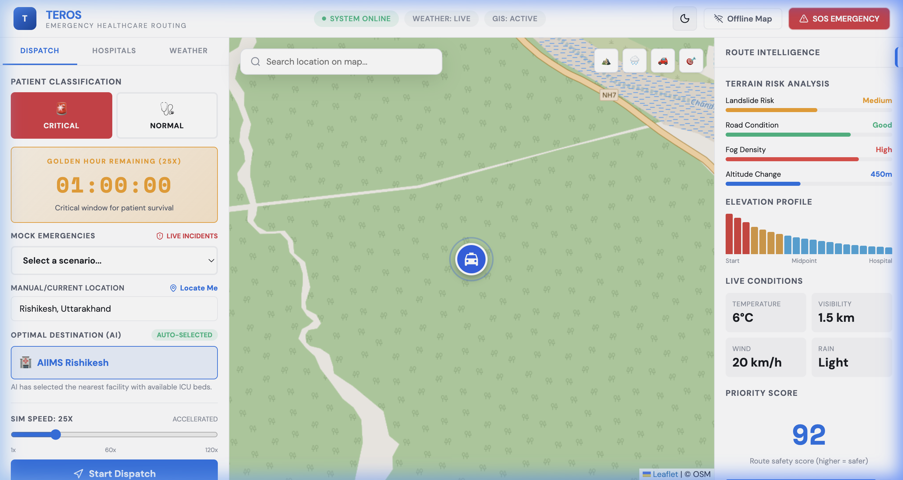

# Teros: Advanced Emergency Routing AI

Teros is a state-of-the-art emergency routing system designed to optimize ambulance dispatch and navigation. Unlike traditional GPS systems that prioritize the shortest distance, Teros uses a **Survivability Index** to determine the safest and most efficient path, accounting for terrain steepness, real-time traffic, weather conditions, and hospital resource availability.

 *(Note: Add a screenshot of your app to `public/preview.png` for better visual appeal)*

## 🚀 Key Features

- **Survival-First Routing**: Prioritizes routes that minimize patient distress and maximize survival probability.
- **Dynamic Terrain Analysis**: Calculates risk scores based on topography and road conditions.
- **Real-time Golden Hour Tracking**: Visual countdown and mission progress monitoring.
- **Smart Hospital Selection**: AI identifies the best hospital based on bed availability and travel time.
- **Interactive Map**: Built with React-Leaflet, providing real-time tracking and multi-route visualization.
- **Emergency Simulation**: One-click SOS and scenario-based simulations for testing efficiency.

## 🛠️ Tech Stack

- **Framework**: [Next.js 15+](https://nextjs.org/) (App Router)
- **Library**: [React 19](https://react.dev/)
- **Mapping**: [Leaflet](https://leafletjs.com/) & [React-Leaflet](https://react-leaflet.js.org/)
- **Icons**: [Lucide React](https://lucide.dev/)
- **Styling**: Vanilla CSS with modern UI/UX principles.

## 📦 Project Structure

```text
teros-app/
├── src/
│   ├── app/            # Next.js App Router (pages and layouts)
│   ├── components/     # UI, Map, Panels, and Layout components
│   ├── lib/            # Utilities, Context, and Mock Data
│   └── styles/         # Global styles and CSS modules
├── public/             # Static assets (images, icons)
├── .env.local          # Environment configuration
└── package.json        # Dependencies and scripts
```

## ⚙️ Setup & Installation

### 1. Clone the repository
```bash
git clone <your-repo-url>
cd teros-app
```

### 2. Install dependencies
```bash
npm install
```

### 3. Configure Environment Variables
Create a `.env.local` file in the root directory and add the following:
```env
NEXT_PUBLIC_MAP_TILE_URL=https://{s}.tile.openstreetmap.org/{z}/{x}/{y}.png
NEXT_PUBLIC_TERRAIN_TILE_URL=https://{s}.tile.opentopomap.org/{z}/{x}/{y}.png
WEATHER_API_KEY=your_api_key
ROUTING_API_KEY=your_api_key
```

### 4. Run the development server
```bash
npm run dev
```
Open [http://localhost:3000](http://localhost:3000) to see the application.

## 🧠 How It Works

1. **Scenario Selection**: The user selects an emergency scenario (e.g., Cardiac Arrest).
2. **Data Integration**: Teros fetches real-time terrain, traffic, and hospital data.
3. **Route Optimization**: The AI calculates multiple routes and assigns a **Survivability Index**.
4. **Dispatch**: The fastest/safest route is displayed, and the Golden Hour timer begins.
5. **Real-time Navigation**: The ambulance follows the path, with dynamic re-routing if conditions change.

## 📄 License

This project is developed for the Yukti Hackathon. © 2026 Pat Hawkers.
